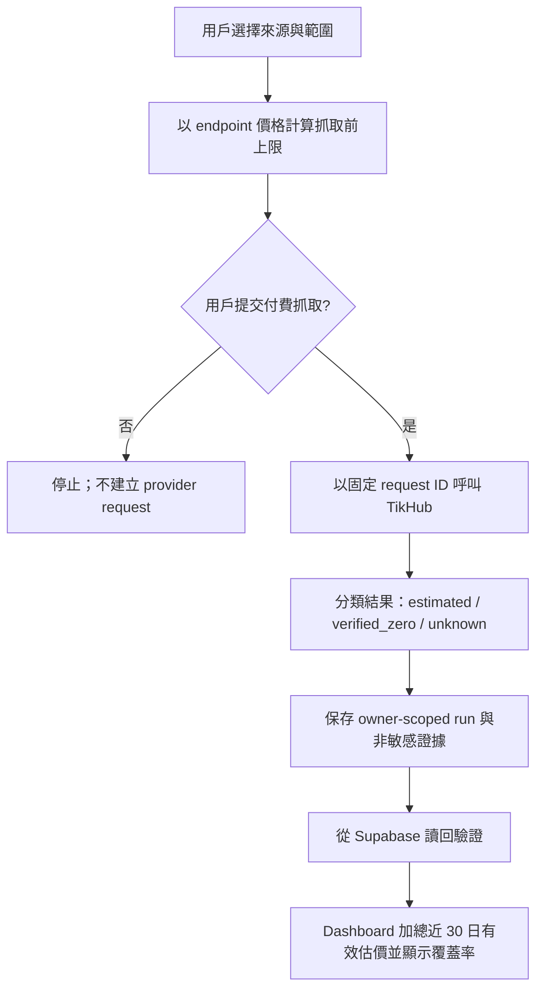

# PRD：Inspiration 抓取費用預估與核對

- 狀態：Approved · Dashboard v0.1 implemented locally
- 版本：0.1
- 日期：2026-09-15
- 對象：PersonalOS 模板維護者
- 範圍：Inspiration 內由 TikHub 產生的抓取紀錄

## 1. 摘要

Inspiration Dashboard 現時把近 30 日 `runs.estimated_cost_usd` 相加，並顯示為「預估抓取費用」。計算本身存在，但現有匯入及 TikHub 工作未必保存估價與來源標記；空值又會被當成 0，因此 `US$0.000` 可能只代表「沒有可計算資料」，而不是「實際沒有費用」。

本功能要讓用戶在抓取前看到合理上限、抓取後看到可追溯估價，並清楚分辨：已估算、部分估算、已核實免收費及未知。Dashboard 不得把未知顯示為零，也不得為了顯示估價而在頁面載入時呼叫付費 API。

## 2. 問題與證據

### 目前行為

- UI 只加總最近 30 日、API 返回的 `estimated_cost_usd`。
- `Number(null) || 0` 令未知費用參與總數時變成零。
- API 只讀取 `metadata.inspiration_origin` 為 `student-demo` 或 `student-import` 的 runs。
- `student-import` 目前只為 Sources 和 Posts 加 `inspiration_origin`，沒有為 Runs 加此標記。
- 目前 workspace 有 4 個 TikHub Instagram 歷史 runs；全部 `estimated_cost_usd`、`request_count` 和 `inspiration_origin` 都是空值。頁面顯示 `US$0.000`，平台列則顯示 `—`。

### 為甚麼重要

- 用戶無法分辨免費、未記錄和真正估算為零。
- 總覽卡與平台列顯示不一致。
- 失敗或狀態不明的工作可能已收費，不能安全假設為零。
- 費用缺乏 endpoint、單價、請求數及價格版本，之後無法重算或審計。

## 3. 目標與非目標

### 目標

1. 抓取前展示本次請求的最高預估費用及計算依據。
2. 每次 TikHub 抓取把費用估價、覆蓋狀態和非敏感證據保存到 owner-scoped Supabase run。
3. Dashboard 正確加總近 30 日有估價的 Inspiration runs，並顯示估價覆蓋率。
4. 未知費用永遠顯示為 `—` 或「部分估算」，不當成零。
5. 頁面重載後仍可從 Supabase 讀回同一結果；不在 Dashboard 載入時產生額外 provider 請求。

### 非目標

- 不建立付款、退款或發票系統。
- 不聲稱 Dashboard 數字等同 TikHub 帳單。
- 不把 ToAPI 文字、圖片分析或生圖 credits 混入美元抓取費用。
- 不更改現有 workspace ownership 或 RLS 模型。
- 不追溯猜測缺少證據的歷史成本。

## 4. 用戶故事

- 作為學生，我想在按下抓取前知道最多大約花幾多，先決定是否繼續。
- 作為學生，我想知道近 30 日有多少抓取已計價、多少仍未知，避免把 `0` 誤解為免費。
- 作為老師，我想由 run 記錄追查 endpoint、請求數、價格來源和核對時間，而不接觸 API key。
- 作為模板維護者，我想在不更改 schema 的前提下修正現有流程和兼容舊資料。

## 5. 名詞與顯示規則

| 狀態 | 意義 | Dashboard 顯示 |
| --- | --- | --- |
| `estimated` | 有 endpoint 單價／官方估價及可計價請求數，但未與帳戶用量對數 | `≈ US$X.XXX` |
| `partial` | 部分 runs 有估價，部分未知 | `≈ US$X.XXX · 部分估算` |
| `verified_zero` | 有明確 provider 回應／規則證明沒有收費 | `US$0.000 · 已核實免收費` |
| `unknown` | 缺單價、請求數、provider 結果或狀態不明 | `— · 費用待核對` |

只有所有納入範圍的 runs 都有可靠狀態，才可顯示純粹的 `US$0.000`。

## 6. 建議體驗

### 6.1 抓取前

在任何「TikHub 計費」按鈕旁顯示：

> 本次最多約 US$0.002 · 1 request · Instagram post info · 以 2026-09-15 已核對單價計算。實際帳單以 TikHub 為準。

若 endpoint 價格未核對：

> 暫時無法估價；提交可能收費。

原有的付費確認規則保持不變；估價本身不構成提交授權。

### 6.2 抓取後

每個 run 保存狀態，然後讀回確認。成功訊息包含：

- 已收集項目數；
- 可計價請求數；
- 本批估價；
- provider request ID（如有，不含 token）；
- 「估價，非帳單」說明。

### 6.3 Inspiration Dashboard

總覽卡顯示：

- 近 30 日可加總估價；
- `已估價 runs / TikHub runs` 覆蓋率；
- 最早／最新價格核對日期；
- 有未知項目時標示「部分估算」。

平台列採用相同狀態規則，不再出現總覽 `US$0.000`、平台 `—` 的矛盾。

## 7. 計算規則

1. 範圍只包括目前 workspace、`provider = 'tikhub'`、屬於 Inspiration 的 runs，並以 `fetched_at` 計最近 30 日。
2. 抓取前上限：`planned_requests × endpoint_base_price_usd`。如有官方階梯估價，可另存 quote，但基本單價上限優先用於安全提示。
3. 抓取後估價：`billable_request_count × effective_unit_price_usd`，或使用 provider 官方價格計算結果。
4. `estimated_cost_usd = null` 必須保持未知，禁止轉成 0。
5. 只在 provider 規則和回應足以證明不收費時保存 `verified_zero`。
6. 網絡中斷、timeout、無 provider status、工作 `unknown` 均保持未知。
7. 匯入資料只有在原始值包含可靠估價與必要上下文時才可標記 `estimated`；否則保留未知。
8. Dashboard 查詢和渲染不可呼叫 TikHub；只讀 Supabase 已保存資料。

TikHub 官方目前說明大多數服務按 request 收費、非 200 通常不收費，亦提供依 endpoint 和每日請求量計價的計算 API；各 endpoint 價格仍須按實際使用的官方頁面核對。例如 Instagram v2 `fetch_post_info` 官方標價為 US$0.002/request。由於階梯折扣和共用 key 流量可能影響最終帳單，本產品仍把結果稱為「估價」。

## 8. Supabase 資料契約

沿用 `public.runs`，不新增欄位。既有欄位：

- `provider = 'tikhub'`
- `platform`
- `request_count`
- `estimated_cost_usd`
- `fetched_at`
- `status`

`metadata` 建議保存：

```json
{
  "inspiration_origin": "student-import | live-fetch",
  "cost_status": "estimated | verified_zero | unknown",
  "cost_basis": "endpoint_base_price | provider_quote | imported",
  "endpoint": "/api/v1/instagram/v2/fetch_post_info",
  "planned_request_count": 1,
  "billable_request_count": 1,
  "unit_price_usd": 0.002,
  "pricing_checked_at": "2026-09-15T00:00:00.000Z",
  "provider_request_id": "non-secret-id",
  "provider_http_status": 200,
  "billing_evidence": "provider-response | documented-rule | none"
}
```

要求：

- 不保存 API key、Authorization header 或完整敏感 response。
- 所有讀寫繼續受 workspace owner RLS 限制。
- 舊 runs 不回填猜測值；缺資料時視作 `unknown`。
- 匯入器須為 Runs 寫入正確 `inspiration_origin`，而不只 Sources／Posts。

## 9. 資料流



## 10. 功能需求

| ID | 需求 | 優先級 |
| --- | --- | --- |
| FR-1 | 每個 live TikHub run 在提交前可取得 endpoint 與預估上限 | P0 |
| FR-2 | 完成／失敗／未知結果都以同一 request ID 更新，不自動重試 | P0 |
| FR-3 | run 保存 `request_count`、`estimated_cost_usd` 或明確 unknown，以及成本 metadata | P0 |
| FR-4 | Runs 匯入保存 `inspiration_origin`；無估價資料不補零 | P0 |
| FR-5 | Dashboard 回傳所有範圍內 TikHub runs，包括 unknown | P0 |
| FR-6 | UI 顯示金額、覆蓋率及估價狀態；未知不顯示為零 | P0 |
| FR-7 | 總覽卡與每平台列使用同一聚合器和格式規則 | P1 |
| FR-8 | Reload 後由 Supabase 得到相同數字和狀態 | P1 |
| FR-9 | 頁面載入不呼叫 TikHub 或任何計費 endpoint | P0 |

## 11. 驗收準則

1. **目前資料回歸測試**：4 個 Instagram TikHub runs 全部缺估價時，總覽顯示 `— · 費用待核對`、覆蓋 `0/4`，而非 `US$0.000`。
2. **單一已估價成功**：一個 `fetch_post_info`、1 個可計價 request、單價 US$0.002 時，顯示 `≈ US$0.002` 和覆蓋 `1/1`。
3. **混合資料**：兩個已估價、一個 unknown 時，只加總兩個金額，並顯示「部分估算 · 2/3 runs」。
4. **已核實零費用**：只有 provider 結果和規則均明確不收費，才顯示 `US$0.000 · 已核實免收費`。
5. **狀態不明**：timeout、無 HTTP status 或 source job `unknown` 不得顯示為零，也不得自動重試。
6. **匯入兼容**：新匯入 Runs 可被 Dashboard 讀取；舊資料不被覆寫或猜價。
7. **安全**：用戶 A 無法讀取用戶 B 的 runs；client response 不包含 provider key 或 Authorization header。
8. **無隱藏費用**：進入或 refresh `/inspiration` 不產生 TikHub network request。
9. **一致性**：同一篩選期間下，平台列已知估價之和等於總覽已知估價。

## 12. 指標與觀測

- `priced_run_coverage = priced_runs / tikhub_runs`
- `unknown_cost_runs`
- `estimated_cost_usd_30d`
- `runs_with_provider_request_id`
- `dashboard_provider_calls` 必須恆等於 0

不需要把分析事件送到第三方；第一版可由 Supabase owner-scoped 查詢及自動測試驗證。

## 13. 推出計劃

1. 先修正純計算及 UI 狀態，加入目前資料的回歸測試。
2. 修正 Runs 匯入 metadata，驗證新匯入及舊資料兼容。
3. 在 live TikHub adapter 保存 endpoint、request count、估價與證據。
4. 用測試 fixture 覆蓋 estimated／partial／verified-zero／unknown。
5. 經明確付費授權後，只做一次小型 live 驗收；讀回 Supabase，再刷新 Dashboard。

## 14. 風險與已定決策

| 風險 | 決策／緩解 |
| --- | --- |
| TikHub endpoint 單價或折扣改變 | 保存 `pricing_checked_at`、endpoint 及計價依據；UI 明示估價非帳單 |
| 共用 API key 的每日用量影響折扣 | 不聲稱 per-workspace 實際帳單；以安全上限或 provider quote 表示 |
| 成功 HTTP 但內容無效仍可能按個別 endpoint 收費 | 成本狀態以 endpoint 規則為準，不能只看資料是否可用 |
| 舊資料缺欄位 | 保持 unknown，不做猜測式 backfill |
| 顯示估價時額外產生 provider 成本 | Dashboard 只讀 Supabase；價格資料由受控配置／抓取流程保存 |
| schema-lock | 第一版只用現有欄位及 `metadata`，不 migration |

## 15. 實作觸點（供模板維護者）

- `components/inspiration-hub.tsx`：狀態聚合及顯示。
- `lib/feed-supabase.mjs`：查詢範圍、live run 保存與讀回。
- `lib/student-import.mjs`：Runs 的 `inspiration_origin` 與未知成本語義。
- TikHub adapters／API routes：固定 request ID、endpoint、回應狀態及非敏感成本證據。
- 測試：聚合器、匯入映射、API 保存／讀回及 Dashboard reload。

## 16. 來源

- PersonalOS 現況：`components/inspiration-hub.tsx`、`lib/feed-supabase.mjs`、`lib/student-import.mjs`、`supabase/01-bootstrap.sql`。
- TikHub 官方介紹及價格：https://docs.tikhub.io/4592751m0
- TikHub 官方價格計算 API：https://docs.tikhub.io/186826052e0
- TikHub Instagram v2 post info 價格：https://docs.tikhub.io/387337824e0
